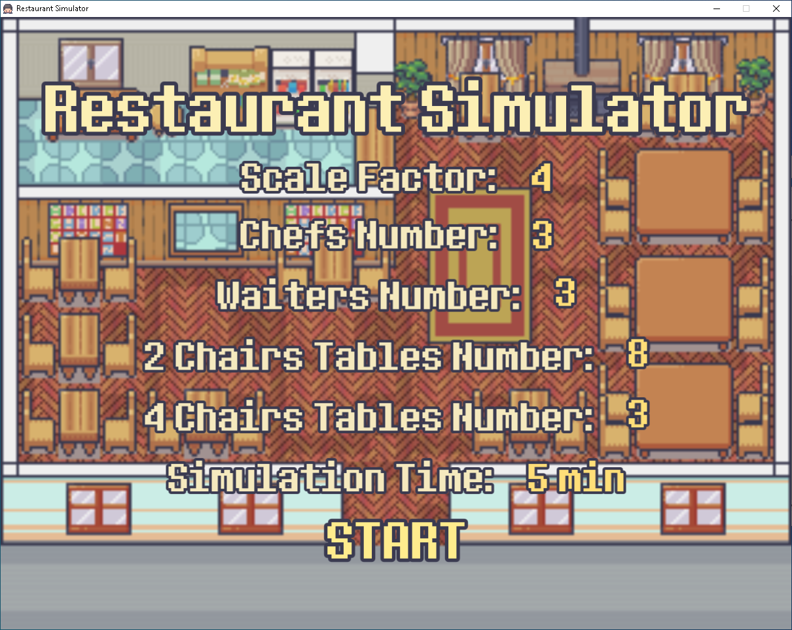
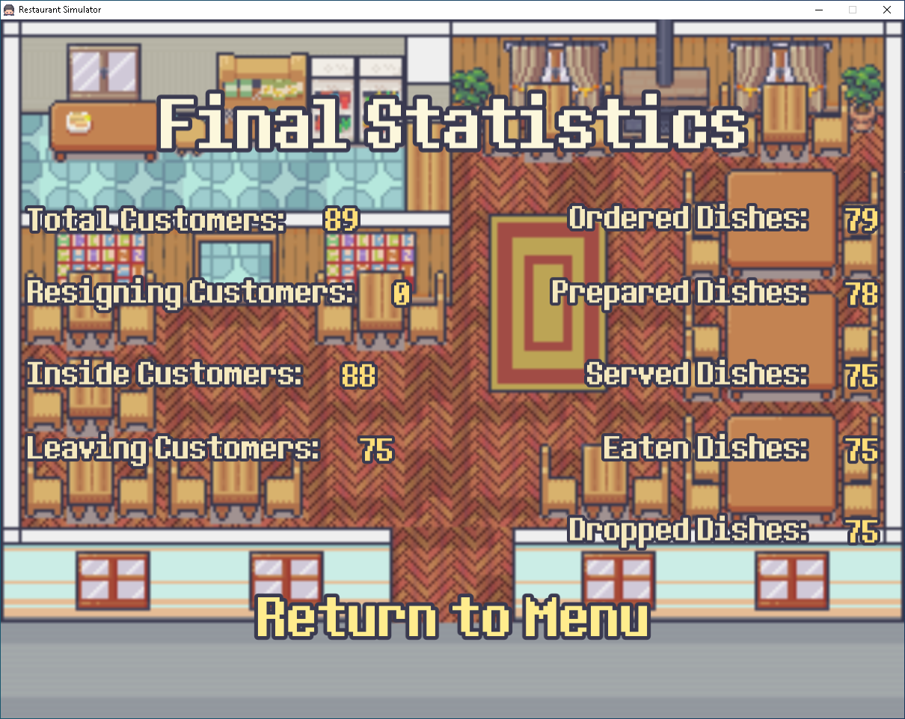

# Restaurant Simulator / Symulator Restauracji

## EN

### Overview
Restaurant Simulator is a 2D restaurant simulator. The user selects parameters such as the number of chefs, the number of waiters, the number of tables, and sets the simulation time. The simulation is then run using probability distributions appropriate to the nature of the events. After it ends, the calculated statistics are displayed and also saved to a file.

### Screenshots




### Technologies
- C++
- SFML 2.6.2
- CMake

### How to Run
1. Configure the project with CMake.
2. Build the `RestaurantSimulator` target.
3. Run the executable from the build directory.

Example (Windows, PowerShell):
```powershell
cmake -S . -B build
cmake --build build --config Release
./build/RestaurantSimulator.exe
```

### Project Structure
```
.
├── assets/              # graphics and fonts
├── build/               # CMake build output
├── dlls/                # runtime DLLs
├── docs/                # documentation
├── external/            # dependencies (SFML)
├── include/             # class/struct headers
├── screenshots/         # screenshots
├── src/                 # implementations
├── CMakeLists.txt       # CMake configuration
├── Installer.nsi        # NSIS installer script
├── README.md            # this file
├── readme.txt           # readme bundled after install
└── resources.rc         # Windows resources
```

## PL

### Opis
Restaurant Simulator to dwuwymiarowy symulator restauracji. Użytkownik wybiera parametry takie jak: liczba kucharzy, liczba kelnerów, liczba stołów oraz ustala czas symulacji. Następnie uruchamiana jest ona uruchamiana z użyciem rozkładów prawdopodobieństwa, zgodnymi z charakterem zdarzeń. Po jej zakończeniu wyświetlone zostają wyliczone statystyki, a także zostają one zapisane do pliku.

### Screeny


### Technologie
- C++
- SFML 2.6.2
- CMake

### Uruchomienie
1. Skonfiguruj projekt przez CMake.
2. Zbuduj target `RestaurantSimulator`.
3. Uruchom plik wykonywalny z katalogu build.

Przyklad (Windows, PowerShell):
```powershell
cmake -S . -B build
cmake --build build --config Release
./build/RestaurantSimulator.exe
```

### Struktura projektu
```
.
├── assets/              # zasoby graficzne i fonty
├── build/               # katalog generowany przez CMake
├── dlls/                # biblioteki DLL
├── docs/                # dokumentacja
├── external/            # zaleznosci (SFML)
├── include/             # naglowki klas i struktur
├── screenshots/         # zrzuty ekranu
├── src/                 # implementacje
├── CMakeLists.txt       # konfiguracja CMake
├── Installer.nsi        # skrypt instalatora NSIS
├── README.md            # ten plik
├── readme.txt           # readme dolaczane po instalacji
└── resources.rc         # zasoby Windows
```
